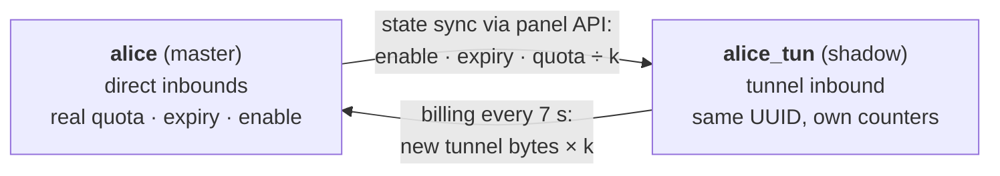

# 3X-UI Traffic Multiplier (xui-mult)

Daemon & CLI tool for inbound traffic multipliers and tunnel overhead compensation on 3X-UI (Sanaei) v3.8.5.

[](LICENSE)
[](https://www.python.org/)
[](https://github.com/MHSanaei/3x-ui/releases/tag/v3.8.5)

[](#verification--tests)

**English** · [فارسی](#فارسی)

---

## The problem

On a tunnel setup, the server moves more bytes than the user does. Transport and TLS framing,
retransmissions and the extra relay hop add up: a user who consumes **1 GB** can cost **1.2–1.3 GB** of
real server traffic.

3X-UI counts only the bytes each client sends and receives on an inbound. It has no per-inbound
traffic coefficient, so every tunnel user is billed 1:1 and you pay the overhead.

**xui-mult** makes traffic through the tunnel inbounds you choose count **k×** against the user's quota
(for example 1.2×). Direct inbounds stay 1:1. The user keeps one account, one UUID and one
subscription link.

| k = 1.2 | Traffic used | Deducted from quota |
|---|---|---|
| Direct inbound | 1 GB | 1 GB |
| Tunnel inbound | 1 GB | 1.2 GB |

## How it works



### Shadow client pattern
- **`alice`** is the master client. It keeps the real quota, expiry and enable state, and stays on
  the direct inbounds.
- **`alice_tun`** is the shadow client on the tunnel inbound. It has the **same UUID/password**, so
  nothing changes on the user's device. It has its own email, so 3X-UI counts tunnel traffic
  separately, and its own subId (v3.8.5 requires unique subIds).
- The tunnel share link is added to `alice`'s subscription as an external link, so the user keeps
  **one subscription URL**.

### Atomic billing with a high-water-mark ledger
Every 7 seconds, each pair is billed in **one `BEGIN IMMEDIATE` SQLite transaction**:

1. Read the shadow's counters and compare them with the ledger's last-seen values (the high-water mark).
2. Add ⌊new bytes × k⌋ to the master, using the same `up = MIN(up + ?, max)` statement as the panel.
3. Advance the ledger and commit both together.

- **The shadow's row is never written.** Its counters only grow, and nothing the panel does to them
  can make a byte count twice.
- **A crash commits all or nothing.** It rolls back both writes, and the next tick bills the same
  bytes exactly once.
- **Fractions of a byte carry over**, so billed = ⌊raw × k⌋ exactly over time.
- **The ledger lives inside `x-ui.db`** (table `tunnel_multiplier_ledger`). Backing up or restoring
  the panel database keeps the two consistent.
- **No race with the panel's traffic loop.** 3X-UI v3.8.5 opens SQLite with `_txlock=immediate` and
  adds traffic with atomic updates, so the panel and xui-mult take turns on the write lock and never
  overwrite each other. This was checked in the v3.8.5 source and tested against a real panel.

### Automatic state sync
Each tick, the service compares the master with its shadow and fixes any difference through the panel
REST API, so Xray is updated live:

| When the master… | The shadow… |
|---|---|
| runs out of quota | is disabled **in the same tick**, without waiting for the panel |
| is disabled or expires | is disabled |
| is re-enabled, renewed or reset | has its counters reset and is re-enabled |
| changes quota, expiry or IP limit | mirrors it; its fail-safe quota = master quota ÷ k |
| is deleted or renamed | is disabled (fail closed) |
| has "start after first use" and the first connection goes through the tunnel | the master's clock starts too |

A failed API call is retried on the next tick. Billing never waits for the API. One broken pair never
stops the others.

## Features
- **Interactive numeric menu:** run `xui-mult`, just like the native `x-ui` script.
- **Subcommands for automation:** `status` exits with code 1 on any problem, for monitoring.
- **Resilient systemd service:** it notifies systemd when ready, and systemd's watchdog (120 s)
  restarts it if it hangs. It also restarts automatically, runs as a single instance, and reconnects
  after a database restore.
- **Zero panel modifications:** it uses the panel's own REST API with an API token and adds one table
  to `x-ui.db`.
- **Safe onboarding:** adding a user is undone step by step if anything fails. `dry-run` shows
  pending billing without writing anything.
- **Fail-safe quotas:** each shadow's quota is capped at master quota ÷ k with the same expiry, so the
  panel still limits tunnel use even if xui-mult stops.
- **Single file, standard library only:** Python 3.9+, no pip packages.

## Requirements
- Linux with systemd, root access.
- 3X-UI **v3.8.5** on **SQLite** (PostgreSQL panels are refused with a clear message).
- Python 3.9+. The installer installs `python3` with apt, dnf or yum if it is missing.
- A panel **API token with full access** (Settings → API tokens). Monitor and node-sync tokens are
  refused because they cannot disable clients.

## Quick installation
Back up the panel database first, then run as root on the panel server:

```bash
cp /etc/x-ui/x-ui.db /root/x-ui.db.bak
bash <(curl -Ls https://raw.githubusercontent.com/mahdizo3181/-3x-ui-multiplier/main/dist/install.sh)
```

At the end, the installer offers to run setup:
- The panel URL is detected from the panel's own settings.
- Paste the API token, then enter the public host your users connect to (it goes into share links).
- If the panel has a domain set, xui-mult sends it as the HTTP Host automatically (the panel rejects
  any other).

Then onboard **one test user first**:

```bash
xui-mult inbounds                             # find the tunnel inbound ID
xui-mult add alice --inbound 5 --mult 1.2     # alice pays 1.2x on inbound #5
xui-mult dry-run                              # pending billing, nothing written
xui-mult status && xui-mult logs -f           # watch a few ticks
xui-mult add-all --from 1 --to 5 --mult 1.2   # then everyone from inbound #1
```

Running the installer again upgrades in place and keeps your settings.

## CLI usage

Running `xui-mult` with no arguments opens the menu:

```text
 xui-mult v1.1.0 — tunnel traffic multiplier for 3X-UI
 Service: ● running   Users: 12   Last tick: 3s ago
 ──────────────────────────────────────────────────────────
   1) Setup / change panel API connection
   2) Add a user to a tunnel
   3) Add ALL users of an inbound to a tunnel
   4) List users and billed tunnel usage
   5) Change a multiplier
   6) Remove a user from tunnel billing
   7) Status & health check
   8) Live logs
   9) Start / Stop / Restart service
  10) Dry-run (show pending billing, write nothing)
  11) List inbounds
  12) Re-sync all shadows & subscription links
  13) Uninstall
   0) Exit
```

Every action is also a subcommand:

| Command | What it does |
|---|---|
| `xui-mult` | Interactive menu |
| `xui-mult setup [--url URL] [--token T] [--link-host H] [--api-host H]` | Connect to the panel API (interactive without options) |
| `xui-mult inbounds` | List inbounds with IDs and client counts |
| `xui-mult add EMAIL --inbound ID --mult K [-y]` | Bill EMAIL's traffic on tunnel inbound ID at K× (1.0–10.0) |
| `xui-mult add-all --from ID --to ID --mult K [-y]` | Pair every client of one inbound with the tunnel inbound |
| `xui-mult list` | Pairs, raw tunnel traffic, billed traffic, quota use, state |
| `xui-mult set-mult EMAIL K` | Change a multiplier (applies to new traffic) |
| `xui-mult remove EMAIL --delete-shadow --reattach` | Stop billing, delete `_tun`, restore 1:1 on the tunnel |
| `xui-mult status` | Health check of every part; exit code 1 on problems |
| `xui-mult dry-run` | Show what would be billed now, write nothing |
| `xui-mult logs [-f] [-n N]` | Service logs (journald) |
| `xui-mult resync` | Force state and subscription-link sync |
| `xui-mult start \| stop \| restart` | Control the service |
| `xui-mult uninstall [-y]` | Unwind all pairs, remove the service; settings kept |

`add` also accepts `--suffix` (default `_tun`) and `--no-sub-link`. Settings live in
`/etc/xui-mult/config.json` (mode 600) and are hot-reloaded by the service.

### Rules to remember
- **Don't edit `_tun` clients by hand.** To block a user, disable the **master**; the shadow follows
  within one tick.
- Change quota, expiry and IP limit on the master only; they are mirrored automatically.
- A user who is already attached to the tunnel inbound is moved to the shadow when added. Their tunnel
  connection drops once, for a few seconds.
- `remove` without `--delete-shadow` leaves an unmanaged `_tun` client that no longer follows the
  master.

## Verification & tests

| Suite | Runs against | Result |
|---|---|---|
| `tests/` unit tests | A mock of the v3.8.5 panel (same tables, endpoints, token scopes, domain check) | **34 / 34 pass** on Python 3.9 and 3.14 |
| `tests/e2e_real_panel.py` | A real 3X-UI v3.8.5 binary built from the official source | **29 / 29 checks pass** |

The unit tests cover:
- concurrent billing races with panel-style writers;
- a process killed mid-transaction, and interrupted transfers;
- zero-byte ticks, and negative or int64-overflowing counters;
- a locked database;
- API outages, bad tokens, limited-scope tokens and skipped bulk operations;
- the full user lifecycle.

The end-to-end run drives the real panel API: pairing, exact 1.2× billing, disable and enable,
running out of quota, renewal, "start after first use", the panel domain check, and removal.

Run everything locally before deploying:

```bash
bash preflight.sh                                  # syntax, unit tests, build, installer == tested code
bash preflight.sh --db ./x-ui.db --real-panel      # + a copy of your production DB + e2e on real v3.8.5
```

- `--db` checks a **copy** of your production database; your file is never modified.
- `--real-panel` builds 3X-UI v3.8.5 from source (needs git, go and gcc, about 2 minutes the first time).

## Known limits
- Connections that are already open may continue for a few seconds after a shadow is disabled.
- The shadow has its own IP-limit counter and online status; the master's "last online" doesn't
  reflect tunnel use.
- At a renewal, the last few seconds of tunnel traffic may go unbilled (in the user's favour).
- WireGuard / AmneziaWG tunnel inbounds are not supported.
- Inbounds on remote 3X-UI nodes have not been tested.
- Verified on v3.8.5 only. The service checks the database layout at start-up, and `status` warns on
  other panel versions. Re-test with `preflight.sh --real-panel` before upgrading 3X-UI.

## Troubleshooting

| `xui-mult status` says | Fix |
|---|---|
| API token rejected (401) | Create a new full-access token, run `xui-mult setup` |
| token may not call … (403) | The token is monitor/node-sync scoped; create a **full access** token |
| 403 … accepts only its own domain | `xui-mult setup --api-host your.panel.domain` |
| share link points to 127.0.0.1 | Set the public host in setup, or an External Proxy on the tunnel inbound |
| database locked | Nothing to do; the tick is billed in full once the panel releases the lock |

`xui-mult logs -f` shows what the service is doing.

## Uninstall
`xui-mult uninstall` offers to unwind every pair first: final billing, re-attaching masters to the
tunnel inbound and deleting the `_tun` clients. It then removes the service. Settings in
`/etc/xui-mult` are kept. With `-y` it does all of this without asking and also drops the ledger
table from `x-ui.db`.

## Development
- `xui_mult.py` is the whole tool: daemon, CLI and menu.
- `install.sh.in` is the installer template. `bash build.sh` embeds `xui_mult.py` into
  `dist/install.sh`.
- Commit `dist/install.sh`: the one-line installer downloads it.

```bash
python3 -m unittest discover tests            # unit tests (mock panel)
python3 tests/e2e_real_panel.py /path/to/x-ui # end-to-end against a real panel binary
bash preflight.sh                             # all checks + build
```

## License
[GPL-3.0](LICENSE)

---

## فارسی

<div dir="rtl">

**xui-mult** سرویس و ابزار خط فرمانی برای پنل 3X-UI (نسخه‌ی v3.8.5 از Sanaei) است. ترافیکِ اینباندهای تانل را با یک ضریب (مثلاً ۱٫۲) از حجم کاربر کم می‌کند تا هزینه‌ی سربار تانل را کاربر بپردازد، نه شما.

### مشکل
در سرورهای تانل، سرور بیشتر از کاربر ترافیک جابه‌جا می‌کند. هدرهای انتقال و TLS، ارسال دوباره‌ی بسته‌ها و مسیر اضافه‌ی سرور واسط باعث می‌شوند هر ۱ گیگابایت مصرف کاربر، ۱٫۲ تا ۱٫۳ گیگابایت ترافیک واقعی روی سرور ایجاد کند. 3X-UI فقط بایت‌های خود کاربر را می‌شمارد و برای اینباندها ضریب ترافیک ندارد؛ پس این اختلاف از جیب شما می‌رود.

### روش کار
- **کلاینت سایه:** برای هر کاربر (مثلاً `alice`) یک کلاینت سایه به نام `alice_tun` روی اینباند تانل ساخته می‌شود. UUID آن همان UUID کاربر است، پس روی دستگاه کاربر چیزی عوض نمی‌شود. ایمیلش جداست، پس ترافیک تانل جداگانه شمرده می‌شود.
- **حسابداری اتمیک:** سرویس هر ۷ ثانیه ترافیک تازه‌ی کلاینت سایه را در ضریب ضرب می‌کند و در یک تراکنش SQLite به حجم مصرفی کاربر اصلی اضافه می‌کند. یک دفتر حساب «آخرین مقدار دیده‌شده» را نگه می‌دارد تا هیچ بایتی دو بار حساب نشود. ردیف کلاینت سایه هرگز تغییر داده نمی‌شود، پس با حلقه‌ی ترافیک پنل تداخلی پیش نمی‌آید.
- **همگام‌سازی وضعیت:** اگر حجم کاربر اصلی تمام شود، منقضی شود یا غیرفعال شود، تانل هم بسته می‌شود؛ با تمدید، دوباره باز می‌شود. حجم، تاریخ انقضا و محدودیت IP از طریق API پنل روی کلاینت سایه تنظیم می‌شوند.
- **یک لینک ساب:** لینک تانل به ساب‌اسکریپشن کاربر اصلی اضافه می‌شود.

### نصب
اول از دیتابیس پنل نسخه‌ی پشتیبان بگیرید و در پنل یک API token با **دسترسی کامل** بسازید (Settings → API tokens). بعد روی سرور، با کاربر root اجرا کنید:

</div>

```bash
cp /etc/x-ui/x-ui.db /root/x-ui.db.bak
bash <(curl -Ls https://raw.githubusercontent.com/mahdizo3181/-3x-ui-multiplier/main/dist/install.sh)
```

<div dir="rtl">

نصب‌کننده در پایان، راه‌اندازی را پیشنهاد می‌دهد. پیش‌نیازها: لینوکس با systemd، پایتون ۳٫۹ یا بالاتر (اگر نصب نباشد، خودکار نصب می‌شود) و 3X-UI روی SQLite. پنل‌هایی که PostgreSQL دارند پشتیبانی نمی‌شوند. اجرای دوباره‌ی نصب‌کننده برنامه را به‌روز می‌کند و تنظیمات حفظ می‌شوند.

### دستورات پرکاربرد

</div>

```bash
xui-mult                                      # منوی عددی
xui-mult inbounds                             # پیدا کردن شماره‌ی اینباند تانل
xui-mult add alice --inbound 5 --mult 1.2     # افزودن یک کاربر با ضریب ۱٫۲
xui-mult dry-run                              # نمایش ترافیکِ حساب‌نشده، بدون تغییر
xui-mult add-all --from 1 --to 5 --mult 1.2   # افزودن همه‌ی کاربران یک اینباند
xui-mult status                               # بررسی سلامت
xui-mult logs -f                              # لاگ زنده
```

<div dir="rtl">

### نکات مهم
- کلاینت‌های `_tun` را دستی ویرایش نکنید. حجم، انقضا و محدودیت IP را فقط روی کاربر اصلی تغییر دهید. برای مسدود کردن کاربر، کاربر اصلی را غیرفعال کنید.
- اگر کاربر از قبل روی اینباند تانل باشد، به کلاینت سایه منتقل می‌شود و اتصال تانلش یک بار، برای چند ثانیه، قطع می‌شود.
- اول روی یک کاربر آزمایشی امتحان کنید، بعد همه را اضافه کنید.
- برای حذف کامل از `xui-mult uninstall` استفاده کنید. این دستور کاربران را به حالت قبل برمی‌گرداند و کلاینت‌های سایه را حذف می‌کند.

### تست‌ها
- **۳۴ تست خودکار** روی شبیه‌ساز پنل v3.8.5: رقابت هم‌زمان با پنل، قطع شدن برنامه وسط تراکنش، دیتابیس قفل‌شده، سرریز عدد و خطاهای API.
- **۲۹ بررسی سرتاسری** روی باینری واقعی 3X-UI v3.8.5 که از سورس رسمی ساخته شده است.

پیش از استقرار، روی کامپیوتر خودتان `bash preflight.sh` را اجرا کنید.

### مجوز
[GPL-3.0](LICENSE)

</div>
